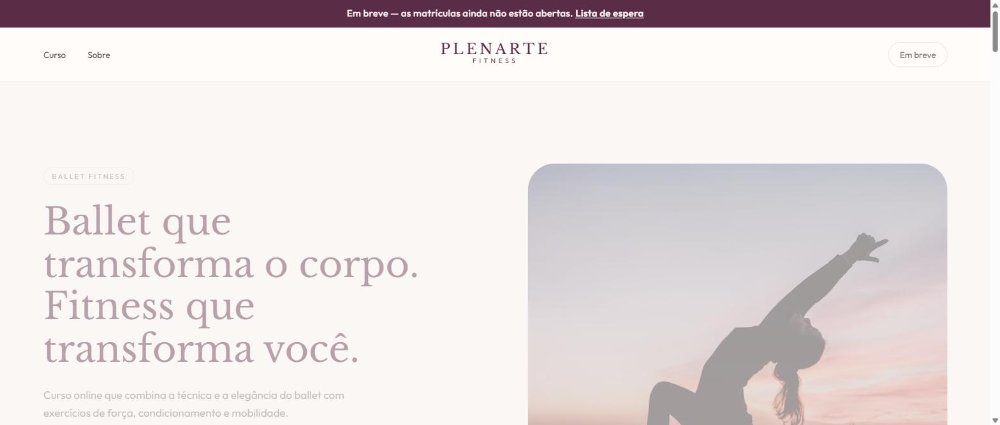

# 💪 Plenarte Fitness — Case de Projeto

Landing page e plataforma de curso online desenvolvida para a Plenarte Fitness, que combina a tecnica e a elegancia do ballet com exercicios de forca, condicionamento e mobilidade. Este repositorio e uma vitrine do projeto (case), sem o codigo-fonte do cliente.

🔗 Site no ar: [plenartefitness.com.br](https://plenartefitness.com.br)

## 💭 Sobre o projeto

O produto e um curso online de Ballet Fitness com planos de assinatura, area logada para as alunas acompanharem as aulas e um painel para a professora gerenciar o curso. No momento, o site esta na fase de pre-lancamento, com landing page e lista de espera para abertura das matriculas.

## ✨ Funcionalidades

Apresentacao dos planos do curso, cadastro na lista de espera, area logada para alunas assistirem as aulas e acompanharem o progresso, e painel administrativo para a professora gerenciar assinaturas e conteudo.

## 🚀 Tecnologias utilizadas

Next.js, React, TypeScript, Tailwind CSS e Motion para animações, com backend em API Routes, autenticacao, banco de dados PostgreSQL e integracao de pagamentos via Mercado Pago.

## 👤 Autor

**Davi Montalvão** — [LinkedIn](https://www.linkedin.com/in/davi-montalvao-dev/) • [GitHub](https://github.com/davi-montalvao)

---

Projeto desenvolvido sob demanda para cliente. Codigo-fonte nao disponivel publicamente.
